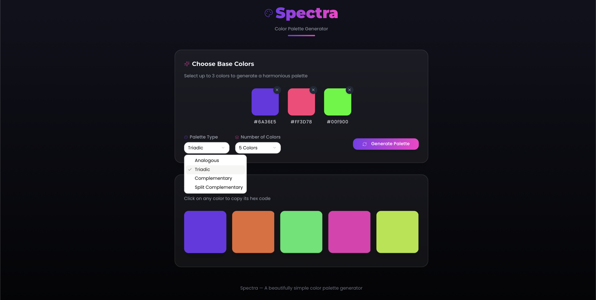

# 🎨 Spectra - Color Palette Generator

<div align="center">
  
  <p><strong>Create harmonious color palettes with ease</strong></p>
</div>

A modern, intuitive color palette generator built with React and TypeScript. Create beautiful color combinations with different harmony rules including analogous, complementary, triadic, and split-complementary.

<div align="center">
  
</div>

## ✨ Features

- **Multiple Color Harmony Modes**
  - Analogous: Colors that are next to each other on the color wheel
  - Complementary: Colors that are opposite each other
  - Triadic: Three colors equally spaced around the color wheel
  - Split-complementary: A base color and two colors adjacent to its complement

- **Customization**
  - Choose from 5, 7, or 9 colors in your palette
  - Interactive color picker for precise color selection
  - Copy color codes with a single click
  - Remove or add colors dynamically

- **Modern UI/UX**
  - Clean, responsive design
  - Smooth animations and transitions
  - Real-time color updates
  - Dark mode optimized

## 🛠️ Tech Stack

- **React 18** - UI Library
- **TypeScript** - Type Safety
- **Vite** - Build Tool
- **Tailwind CSS** - Styling
- **Radix UI** - Accessible Components
- **Framer Motion** - Animations
- **React Query** - Data Fetching

## 🚀 Getting Started

### Prerequisites

- Node.js (v16 or higher)
- npm or yarn

### Installation

1. Clone the repository
```bash
git clone https://github.com/06sarv/spectra.git
cd spectra
```

2. Install dependencies
```bash
npm install
# or
yarn install
```

3. Start the development server
```bash
npm run dev
# or
yarn dev
```

4. Build for production
```bash
npm run build
# or
yarn build
```

## 📁 Project Structure

```
spectra/
├── client/                # Frontend application
│   ├── src/
│   │   ├── components/    # React components
│   │   │   ├── ColorPicker.tsx
│   │   │   ├── PaletteControls.tsx
│   │   │   └── ...
│   │   ├── hooks/        # Custom React hooks
│   │   │   └── usePaletteGenerator.ts
│   │   ├── lib/          # Utility functions
│   │   │   └── colorUtils.ts
│   │   ├── pages/        # Page components
│   │   │   └── PaletteGenerator.tsx
│   │   └── main.tsx      # Entry point
│   └── index.html        # HTML template
├── public/               # Static assets
│   └── icon.png         # App icon
└── ...config files
```

## 🎯 Usage

1. **Select Harmony Mode**
   - Choose from different color harmony rules
   - Each mode creates unique color relationships

2. **Customize Colors**
   - Click on any color to open the color picker
   - Add or remove colors as needed
   - Copy color codes by clicking on them

3. **Adjust Palette Size**
   - Select between 5, 7, or 9 colors
   - Perfect for different use cases

## 🤝 Contributing

Contributions are welcome! Please feel free to submit a Pull Request. For major changes, please open an issue first to discuss what you would like to change.

1. Fork the repository
2. Create your feature branch (`git checkout -b feature/amazing-feature`)
3. Commit your changes (`git commit -m 'Add some amazing feature'`)
4. Push to the branch (`git push origin feature/amazing-feature`)
5. Open a Pull Request

## 📝 License

This project is licensed under the MIT License - see the [LICENSE](LICENSE) file for details.


---

<div align="center">
  <strong>Made with ❤️ by Sarvagna</strong>
</div> 
